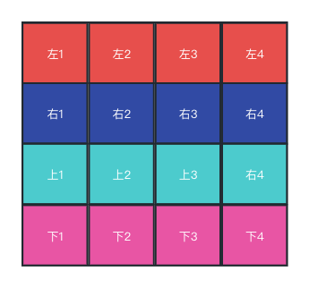

&emsp;&emsp; Canvas对前端来说又陌生有熟悉，熟悉是大多数人都知道并且了解，而陌生则是前端大部分业务很少的场景使用canvas，如果有些动效什么的直接制作成一个文件，格式类似svga、apng、webp甚至是gif图直接完成，既省时、又省力，所以canvas在前端领域并不是那么重要。但是，没错，还有但是，但是你在这方便领域有所擅长，那就是如虎添翼，炫酷的动效你就整吧，使劲整，往死使劲奥。

&emsp;&emsp; 我对canvas是属于陌生的那类人群，也是因为需求被赶鸭子上架了。。。

&emsp;&emsp; 大致就是要实现一个人物在页面上行走这样，方向是可以上线左右运动的。起初我打算直接用4个svga文件，方向分别是上、下、左、右，然后移动这个dom。但是这样会有一个问题，人物在向右运动之后再向下运动的话，因为调转方向需要切换svga文件。在运动的时候切换svga文件，在切换的过程中会有衔接不连贯的视觉问题（类似王者中的闪现效果）。所以这种方案被pass了。

&emsp;&emsp; 当初是感觉canvas能搞，由于时间比较紧迫像找一个比较省事的方案。可是这个方案有问题，然后开始调研canvas。最终通过canvas实现了这个比较让人头疼的需求。

#### 图片

&emsp;&emsp;首先需要一张有头的朝向以及人物运动的分解动作，这些放在一张图片上即可。因为都是等比例的大小方便使用。其中1/2/3/4代表人物在运动过程中的动作，而上、下、左、右则是面对的方向。

#### 方法

&emsp;&emsp;然后需要用到canvas中的一个api--drawImage。它的功能主要是把一张图片裁剪成你需要的图片。类似我们手机中照片有裁剪的那个功能。[drawImage详细用法查看](https://developer.mozilla.org/en-US/docs/Web/API/CanvasRenderingContext2D/drawImage)。

#### 实现

&emsp;&emsp;在裁剪的过程中移动裁剪的图片这样就能够实现人物在行走。如果调转方向则直接将图片裁剪区域按照等比例下移或者上移，也不会出现衔接不连贯问题。每次在绘制的时候需要调用clearImage这个方法来清楚上一帧，要不然页面会出现很多帧的图片就像贪吃蛇一直在吃豆子一样。

