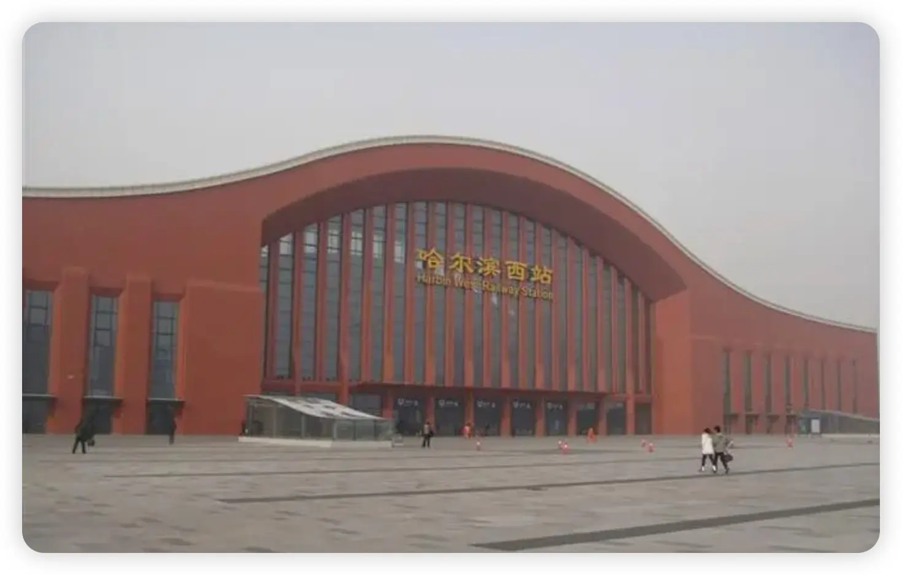
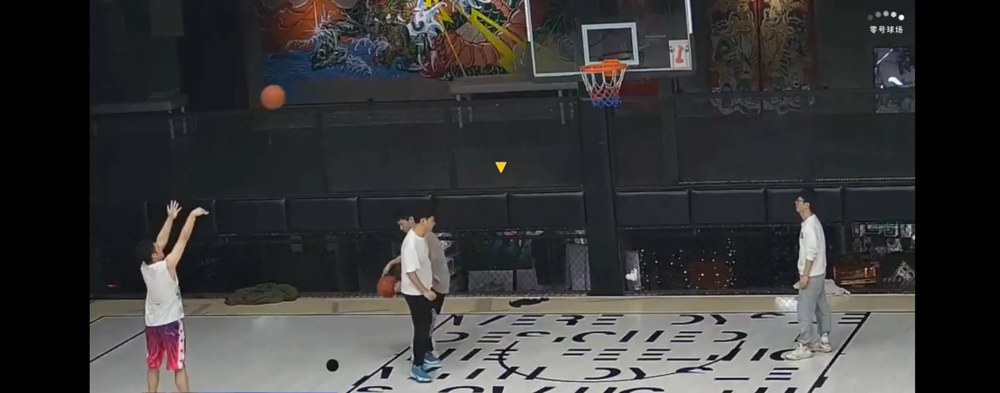

> 偶然在网上看到一个博客网站感觉很好，自己便搞了一个博客网站。效果感觉很不错，很有意思的。第一篇文章就感慨下已逝去的2023吧。哈哈哈

&emsp;&emsp;春节过后从老家前往北京继续“搬砖”，那时候新冠疫情还没有结束，不知不觉疫情已经持续了3年了。车站的人还是那么多，每个人都带着口罩，熙熙攘攘的人群让冬天的冷多了几分喧嚣。下午两点多的高铁，提前十分钟开始排队检票，到了自己的座位上之后开始了漫长七个小时的旅程，一路上除了雪还是雪，除了萧条还是萧条。晚上九点多到的北京。到北京后拉着我的行李箱，坐上了十几亿的座驾--高铁。一心想回到我自己的小臭屋，那里是我的天下~

&emsp;&emsp;到北京后的第二天开始了23年的第一天上班，依旧是往常的节奏。老三样：需求评审、排期开发、跟测上线。新年的第一个需求就接了一个大活--类似塔防类的游戏需求。需求评审完就开始调研技术方案，由于时间紧迫选择用h5开发，没有选择其他的框架。开发中遇到了很多的问题最终的结果还是如期上线了。这个需求也是我们直播首次通过h5实现的塔防类游戏，心里还是有点小成就感的，哈哈哈。

&emsp;&emsp;到了五月份的时候一年一度的晋升开始，很幸运也和感谢组长的提拔，我获得了晋升答辩的提名。我开始准备晋升答辩的材料，这时候又感受到：写代码好的不如PPT做的好。一头雾水写的很烂，自己改了很多次，组长当时也帮我修改了很多，讲真的挺感谢他的。答辩的时候刚开始心里挺紧张的，慢慢的就好了很多。流程大概就是PPT演讲20分钟、评委提问级总结10分钟，一共30分钟。应该是在七月份的时候得到了通知，晋升通过了。

&emsp;&emsp;国庆节的时候回了趟老家，家里没有太多的变化，和父母聊天聊了很多。可能是从小就是东北长大的原因吧，还是感觉东北菜特别好吃，所以感觉母亲做的菜贼香。假期很快结束了又一次回去“搬砖”了，再回来就要等到过年的时候了。

&emsp;&emsp;国庆节之后公司组织的篮球场地从Box 24小时空间 篮球馆换到了My Court篮球馆。据说是网红篮球馆，没准也能打开流量密码啥的，哈哈哈。球馆确实不错，对于我们这些业余的选手来说基本上够用了。唯一的缺点就是离我们公司有点远，骑车需要二十分钟。那时候天气还不是很冷，基本上都能克服，但是有些同事因为太远就不参加了。天气越来越冷了，才发现这个问题越来越严重了。又有几个兄弟没有扛过这个寒冷的冬天，他们也掉队了。可能我们一直坚持的人才是对篮球的热爱吧。后来大家建议能否换回之前的球馆，我身为篮球队长本以为能通过自己的力量来扭转局势，奈何行政油盐不进，最终无果。于是使出阿Q精神安慰法：对付玩吧，总比没有强。

奉上一张在box美如画的投篮姿势吧，对、没错，投篮的就是我。

&emsp;&emsp;马上23年要结束了，希望24年能更加顺利吧。

&emsp;&emsp;再见2023，你好2024。
